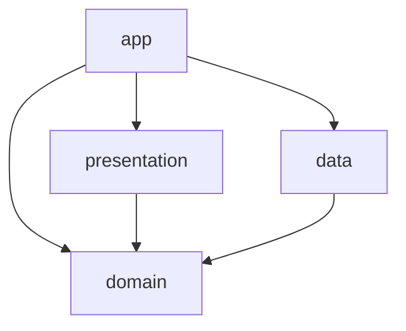

안드로이드 앱 개발자의 정체성을 잃지 않기 위해, 1인 개발로 사이드 프로젝트를 시작했다.

혼자 하더라도 후루룩 만들고 끝낼게 아니라 스토어에 배포하고 admob까지 붙일 생각이라 `멀티모듈+CleanArchitecture`와 같은 구조부터 잘 잡고 들어가기로 했다.

구조는 app, data, domain, presentation으로 나눴다.



- 📦 `app`               // android.application
- 📦 `presentation`       // android.library
- 📦 `data`               // android.library
- 📦 `domain`             // kotlin.jvm

data모듈에 firebase를 넣기 위해서 `android.library`모듈로 선언했다. 외부 sdk는 data모듈에서 끝내고 싶은데 android 의존성을 안넣을수가 없기 때문에... 어쩔 수 없었다.

그 동안 클린아키텍쳐를 지향한다고 말을 하면서 domain레이어를 거의 repository 호출용으로 사용했기 때문에 이번에는 잘 써보려고 한다. 비즈니스 로직만 남겨두고, KMP로 진화시킬 생각도 있다.

거의 6개월만에 안드로이드 앱 개발을 다시 하던 중, 모듈을 나누는 과정에서 아래 에러에 직면했다.

```text
This application (com.ilque.app) is not configured to use dynamic features.
Please ensure dynamic features are configured in the build file.
Refer to https://developer.android.com/guide/playcore/feature-delivery#base_feature_relationship
```

dynamic-features 설정을 넣은 적이 없는 데 위와 같은 에러가 발생했는데, 기존 app 모듈에서 쓰던 파일들을 그대로 presentation에 복사하면서 생긴 문제였다.

## application vs library

둘다 gradle plugin으로, 역할이 다르다. 가장 큰 차이라고 하면 application은 앱의 진입점 역할을 하고, library는 그게 아닌 것을 꼽을 수 있다.

`com.android.application`는 Android 앱을 실제로 실행하고 배포할 수 있도록 만드는 플러그인으로 aab, apk를 빌드할 때 사용하는 assembleDebug, bundleRelease, installDebug, signingConfig의 task를 생성한다.

| Task                | type      | 역할                               |
| ---------------------- | ----------- | -------------------------------- |
| `assembleDebug`        | application | 디버그용 APK 생성                      |
| `bundleRelease`        | application | 릴리즈용 App Bundle 생성 (Play Store용) |
| `assembleRelease`      | library     | AAR 라이브러리 빌드                     |
| `generateReleaseRFile` | library     | R 클래스 생성 (리소스 정리 목적)             |

또한, 앱의 고유한 진입점이기 때문에 applicationId를 반드시 필요로 한다. 이게 스토어에 등록되는 package name이다. 그래서 위에 발생한 에러의 원인을 다시 규명해보면 여러 개의 application 플러그인이 있으면 gradle이 뭘 앱으로 실행해야 할지 결정할 수 없기 때문에 발생하는 에러라고 할 수 있다.

`com.android.library`는 앱 실행은 불가능하고 다른 모듈에서 재사용 가능한 기능 집합(android archive)을 만드는 플러그인이다. 다른 모듈과 같이 applicationId 설정 없이 namespace만 정의하면 된다.

Manifest역시 application이 있는 모듈에만 작성하면 된다. library가 선언된 모듈에도 매니페스트를 작성해도 되는데, app모듈과 충돌날 경우에는 application이 우선이기 때문에 주의해야된다. 그래서 theme같은 경우에도 의도한 대로 동작하지 않을 때, app모듈과 다른 점이 있는 지 확인해보는게 좋다.

## ktlint까지

혼자서 작업하다 보니, 코드리뷰를 따로 할 수 없는 상황이다. CodeRabbit과 같은 서비스를 사용하면 되지만 아직 잘 쓸 줄 몰라 연구가 필요하다.

그래서 lint + formatter를 찾다가, 아직 써보지않았던 ktlint를 적용했다.

```gradle
alias(libs.plugins.ktlint) apply false // root-plugin
alias(libs.plugins.ktlint) // 각 모듈의 plugin
```

이거면 끝난다. gradle 명령어로 ktlintFormat, ktlintCheck를 자주 쓰는데, Format은 고칠 수 있는 부분을 고쳐주고, Check는 검사만 해주는 명령어다.