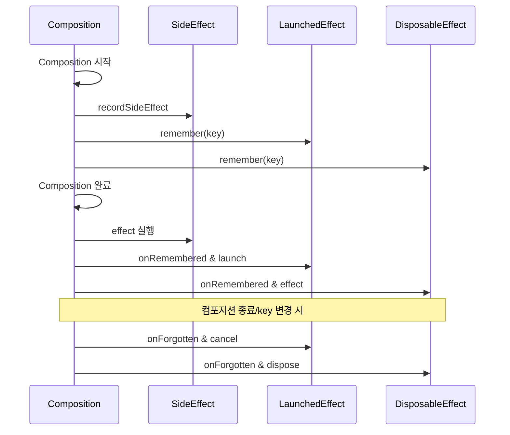

## SideEffect, LaunchedEffect, DisposableEffect 알아보기

```kotlin
@Composable
@NonRestartableComposable
@ExplicitGroupsComposable
@OptIn(InternalComposeApi::class)
fun SideEffect(
    effect: () -> Unit
) {
    currentComposer.recordSideEffect(effect)
}
```

Compose에서 SideEffect는 컴포지션 이후에 실행되는, UI 그리기와 무관한 부수 효과(예: 로그 기록, metrics 기록, 외부 시스템 호출 등)를 처리하기 위한 용도다.
DB 업데이트나 API 호출처럼 실제 외부 상태를 변경하는 동작을 의미하지만, 반드시 모든 ‘UI 작업 이외의 동작’이 SideEffect여야 하는 것은 아니다.

특히, 비동기 작업은 SideEffect가 아니라 LaunchedEffect에서 해야 한다.

공식문서에서 번역을 부수효과라고 해놨는데 그냥 SideEffect가 더 낫다. 동작원리에 대해 알아보기 전에, SideEffect는 순수함수 개념과 같이 돌아다니는데 이걸 먼저 짚고 가자. 같은 입력에 대해 항상 같은 출력을 생성하고 SideEffect가 없는 걸 순수함수라고 한다. 그게 Composable인데, 아래 코드를 보자. 

```kotlin
@Composable
fun UserCard(user: User) {  // 같은 User 객체에 대해 항상 동일한 UI를 생성
    Column {
        Text(user.name)
        Text(user.email)
    }
}

@Composable
fun UserCard(user: User) {
    Column {
        Text(user.name)
        Text(user.email)
        LaunchedEffect(Unit) {
            database.logUserView(user.id)  // SideEffect
        }
    }
}
```

컴포저블 함수에 SideEffect가 들어가면, 같은 입력에 대해 항상 같은 출력을 내는 순수함수 특성이 깨진다.
그래서 SideEffect 사용은 순수함수 규칙의 예외다.

그래서 두번째 UserCard는 비순수함수라고 할 수 있겠다. 근데 무조건 사용해야하는 경우가 많다. UI는 동일한걸 출력하지만 지금 코드처럼 logging이 필요하거나 api call이 필요하거나 할 때는 SideEffect를 안 쓸수가 없는데, 이걸 Composition과 SideEffect의 실행을 분리하면 해결된다.

```kotlin
@Composable
fun MyScreen() {
    var stateCnt by remember { mutableStateOf(0) }
    
    Column {
        Text("Count: $stateCnt")
        Button(onClick = { stateCnt++ }) {
            Text("증가")
        }
    }
    
    LaunchedEffect(stateCnt) {
        println("증가했어요 $stateCnt")
    }
}
```

컴포저블 함수 내에 있어도 LaunchedEffect/SideEffect는 UI 트리 그리기와 별도의 타이밍에 실행된다.

특히 LaunchedEffect는 컴포지션이 완료된 직후 key 변화 등 이벤트에 따라 코루틴을 통해 실행된다.

이러면 `LaunchedEffect`로 등록되었지만, `stateCnt`가 변화할 때만 print문이 출력된다. 이러면 UI는 항상 같은 입력에 대해 같은 출력을 반환한다. 순수함수를 지킨 것이다.

이전 게시글에서 썼던 recomposition을 결합해보면, stateCnt가 onClick으로 인해 증가하고, Text가 그에따라 recomposition되고, 그러고 나서 LaunchedEffect가 호출돼서 print가 출력된다는 것을 알 수 있다.

SideEffect 종류는 크게 3가지로 잡아볼 수 있다. 

-   `SideEffect`: 매 리컴포지션마다 실행되어야 하는 간단한 동기 작업
-   `LaunchedEffect`: 비동기 작업이나 코루틴 기반의 장기 실행 작업
-   `DisposableEffect`: 정리가 필요한 리소스 관리

SideEffect 부터 보자. 

```kotlin
@Composable
@NonRestartableComposable
@ExplicitGroupsComposable
@OptIn(InternalComposeApi::class)
fun SideEffect(
    effect: () -> Unit
) {
    currentComposer.recordSideEffect(effect)
}
```

Composer에 effect를 기록하기만 하고, 이 effect는 컴포지션이 성공적으로 완료된 후에 실행된다. 모든 리컴포지션마다 실행되기 때문에, 많은 recomposition이 발생할 수 있는 SideEffect는 LaunchedEffect로 관리해야된다.

LaunchedEffect는 가장 복잡한 SideEffect다. 

```kotlin
internal class LaunchedEffectImpl(
    parentCoroutineContext: CoroutineContext,
    private val task: suspend CoroutineScope.() -> Unit
) : RememberObserver {
    private val scope = CoroutineScope(parentCoroutineContext)
    private var job: Job? = null

    override fun onRemembered() {
        // This should never happen but is left here for safety
        job?.cancel("Old job was still running!")
        job = scope.launch(block = task)
    }

    override fun onForgotten() {
        job?.cancel(LeftCompositionCancellationException())
        job = null
    }

    override fun onAbandoned() {
        job?.cancel(LeftCompositionCancellationException())
        job = null
    }
}

@Composable
@NonRestartableComposable
@OptIn(InternalComposeApi::class)
fun LaunchedEffect(
    key1: Any?,
    block: suspend CoroutineScope.() -> Unit
) {
    val applyContext = currentComposer.applyCoroutineContext
    remember(key1) { LaunchedEffectImpl(applyContext, block) }
}
```

초기화되면, 부모 코루틴 컨텍스트를 받아 새로운 CoroutineScope를 만든다. 컴포지션에 진입할때는 이전에 실행 중이던 작업이 있을경우 취소해버리고 새로운 코루틴을 시작하여 주어진 task를 실행한다.

remember(key1)에서는 key가 변경될 때 새로운 LaunchedEffectImpl 인스턴스가 생성됩니다. 이때 이전 인스턴스의 작업은 취소되고, 새로운 작업이 시작된다.

앞서 SideEffect는 컴포지션이 끝난 뒤에 실행된다고 했는데, 컴포지션에서 제거될 때 LeftCompositionCancellationException을 사용하여 코루틴을 취소하게된다. 이 예외는 stacktrace를 최적화하여 성능을 개선한다고 한다.

LaunchedEffect를 사용할 때, Key를 꼭 써야한다.


```kotlin
private const val LaunchedEffectNoParamError =
    "LaunchedEffect must provide one or more 'key' parameters..."

@Deprecated(LaunchedEffectNoParamError, level = DeprecationLevel.ERROR)
```

key 파라미터를 강제하도록 되었기 때문에 이걸 지켜줘야한다. 현재는 key 없이 LaunchedEffect 사용하는 방식을 아예 금지(컴파일 에러)한다. key로 Unit을 넣으면 컴포지션 한 번만 실행된다. key를 잘못 설정하면 의도치 않게 effect가 여러 번 실행될 수 있다.

DisposableEffect도 LauncedEffect와 유사한 부분이 있지만, onDispose안에서 호출돼야한다.

```kotlin
private class DisposableEffectImpl(
    private val effect: DisposableEffectScope.() -> DisposableEffectResult
) : RememberObserver {
    private var onDispose: DisposableEffectResult? = null

    override fun onRemembered() { // 실제 실행단계
        onDispose = InternalDisposableEffectScope.effect()
    }

    override fun onForgotten() {
        onDispose?.dispose()
        onDispose = null
    }

    override fun onAbandoned() {
        // Nothing to do as [onRemembered] was not called.
    }
}

@Composable
fun DisposableEffect(
    key1: Any?,
    effect: DisposableEffectScope.() -> DisposableEffectResult
) {
    remember(key1) { DisposableEffectImpl(effect) }
}
```

effect가 DisposableEffectScope로 감싸져있기 때문에, onDispose안에서 작업을 수행하며 onRemember에서 컴포지션에 들어올 때 호출된다. DisposableEffectScope를 좀 더 봐야된다.

```kotlin
class DisposableEffectScope {
    /**
     * Provide [onDisposeEffect] to the [DisposableEffect] to run when it leaves the composition
     * or its key changes.
     */
    inline fun onDispose(
        crossinline onDisposeEffect: () -> Unit
    ): DisposableEffectResult = object : DisposableEffectResult {
        override fun dispose() {
            onDisposeEffect()
        }
    }
}
```

crossline 키워드를 써서, 람다가 비지역 리턴을 사용하지 못하도록 해서 dispose 로직의 안정성을 보장한다. crossline은 inline 키워드랑 같이 볼 때 의미가 있는데, 아래 코드로 이해해보자.

```kotlin
inline fun unsafeOperation(callback: () -> Unit) {
    thread {
        callback()  // 다른 스레드에서 비지역 반환은 위험
        // return 이 가능하다
    }
}

inline fun safeOperation(crossinline callback: () -> Unit) {
    thread {
        callback()  // crossinline으로 비지역 반환이 강제 금지
    }
}
```

inline 함수는 컴파일 시점에 함수 호출 부분이 함수의 본문으로 대체되는 함수다. 그리고 비지역 반환이란 람다를 포함하는 외부 함수에서 반환하는 것을 의미한다. 그래서 inline함수를 쓰면 return 값을 호출부에서 꺼낼 수 있게되는데, crossline으로 이걸 막는 것이다.

그래서 onDispose 함수에서 return을 사용하지 못한다.


---

###  그럼 어떻게 쓰는 게 좋을까?

#### > `SideEffect`의 경우

먼저, state가 변하는 코드를 SideEffect에 넣으면 안된다. recomposition이 발생할 때 마다 SideEffect가 호출되는데 state가 변하는 코드가 SideEffect 내부에 있으면 무한 리컴포지션이 발생해버린다.

```kotlin
@Composable
fun UserProfile(user: User) {
    var lastSeenTime by remember { mutableStateOf<Long?>(null) }
    SideEffect {
        lastSeenTime = System.currentTimeMillis()
    }

	// 이게 맞는 방법
    var lastSeenTime by remember { mutableStateOf<Long?>(null) }
    LaunchedEffect(Unit) {
        lastSeenTime = System.currentTimeMillis()
    }
}
```

따라서 LauncedEffect로 처음 Composition이 될때만 적용되도록 제어하거나, 다른 방법을 이용해서 state를 관리해야된다. 여기서 또 확장되는 게, SideEffect에서는 비동기 작업(코루틴, suspend 등)을 직접 실행할 수 없다.

SideEffect는 무조건 동기 코드만 넣을 수 있고, 오래 걸리는 작업이나 suspend 함수는 반드시 LaunchedEffect에서 처리해야 한다.
SideEffect에서 비동기 실행 시(예: GlobalScope.launch), 컴포즈 생명주기와 분리되어 메모리 누수, 예외 등 문제가 생길 수 있으니 금지다.

그렇다면 동기작업만 해야되는데, 이 동기작업이 너무 오래 걸리면 UI 업데이트에 영향을 줄 수도 있다! 그래서 SideEffect는 동기작업, 가벼운 작업, state를 직접 바꾸지 않는 작업만 수행해야된다.

정리하자면 SideEffect는 컴포지션(recomposition)이 성공적으로 끝난 후 실행되며 여러 SideEffect가 있다면 등록된 순서대로 실행된다.

####  > `LaunchedEffect, DisposableEffect`의 경우

LaunchedEffect의 경우, 키가 무조건 있어야한다. 그런데 필요한 키만 있어야한다.

```kotlin
LaunchedEffect(userId) {
    viewModel.loadUserData(userId)
}
```

그리고 객체를 키로 쓰기보다는 그 객체의 key를 remember에 넣어줄 key로 사용하는 게 더 최적화할 수 있는 방법이다.

또한 아까 내부 구조를 봐서 알겠지만, 이미 코루틴 스코프가 있기에 스코프를 또 선언해줄 필요가 없다.

```kotlin
val scope = rememberCoroutineScope()
LaunchedEffect(messages) {
    scope.launch { // 불필요한 중첩된 코루틴
        processMessages(messages)
    }
}

// 그냥 쓰면된다.
LaunchedEffect(messages) {
    processMessages(messages)
}
```

DisposableEffect도 유사하다. 다만 리소스 해제를 여기서 해줄 때 일부만 하지말고 해야될 거 다 해제시켜야 메모리 누수가 없다.

```kotlin
DisposableEffect(Unit) {
    onDispose {
        locationManager.stopTracking()
        locationManager.releaseResources()
        locationManager.unregisterListeners()
    }
}
```

근데 하나 오해할만한 부분이 있다. 

DisposableEffect의 실행시점은 언제일까? 현재 Unit으로 걸어둔 걸 기준으로 한다.

```kotlin
DisposableEffect(Unit) {
    Log.d(TAG, "Greeting: outer")
    onDispose {
        Log.d(TAG, "Greeting: inner")
    }
}
```

당연히 outer는 먼저 찍힌다. DisposableEffect가 Decomposition에서 호출되는 게 아니라, onDispose 내부 작업이 Decomposition이후에 일어난다. 이걸 구분해야된다.

그래서 아까 리소스 관련 코드를 좀 더 제대로 쓰자면 아래와 같이 쓸 수 있다.

```kotlin
DisposableEffect(Unit) {
    val locationManager = getLocationManager()
    locationManager.startTracking()

    onDispose {
        locationManager.stopTracking()
        locationManager.releaseResources()
        locationManager.unregisterListeners()
    }
}
```

리소스 사용 시점도, 해제 시점도 다 DisposableEffect 내부에 걸어둬서 자동으로 정리되게 하는 방법이다.

DisposableEffect는 Back Handler 쓸 때도 유용하다.

```kotlin
@Composable
fun BackHandler(enabled: Boolean = true, onBack: () -> Unit) {
    val currentContext = LocalContext.current
    
    val dispatcher = (currentContext as? ComponentActivity)
        ?.onBackPressedDispatcher
        ?: return

    DisposableEffect(dispatcher, enabled) {
        val callback = object : OnBackPressedCallback(enabled) {
            override fun handleOnBackPressed() {
                onBack()
            }
        }
        
        dispatcher.addCallback(callback)
       
        onDispose {
            callback.remove()
        }
    }
}
```

현재 액티비티의 context를 가져와서 dispatcher를 제어하기 때문에 callback을 설정하고 해제해주는 작업이 필수적이다.

그래서 위 코드를 보면 key로 enable, dispatcher 두개를 받아 설정하는데 핸들러가 enabled 값을 외부에서 받아 on/off되는 거 하나랑 외부에서 생성한 dispatcher를 주입받아 사용하는 거 하나다. 트리거로 사용할 key가 그래서 enabled 하나고, dispatcher는 crossline 때문에 DisposableEffect 내부에서 생성해서 반환하지 못하니까 주입하는 방식으로 이해하면되겠다.

주의할 점으로 DisposableEffect의 onDispose에서 최신 콜백/값을 참조하고 싶으면 rememberUpdatedState를 반드시 써야 한다는 것이다. 그렇지 않으면 effect 선언 당시의 오래된 값을 캡처할 수 있다.

Effect 형제들의 사용 시나리오는 아래로 이해하면 된다.



**\> "Composition 시작"** 

이때 Compose runtime 이 UI 트리를 구성하기 시작한다. 모든 @Composable 함수들이 호출되면서 화면이 그려진다.

**\> "remember(key)"** 

LaunchedEffect와 DisposableEffect 모두 remember를 통해 인스턴스를 생성하는 걸 아까 코드로 살펴봤다. 이때 key가 변경되지 않는 한 같은 인스턴스가 재사용된다.

**\> "effect 실행"**

SideEffect의 경우, Composition이 완료된 후 recordSideEffect로 등록했던 SideEffect가 실행된다.

나머지 두개는 onRemembered에서 실행이 되는데 

- LaunchedEffect의 경우, onRemembered가 호출되면서 코루틴이 시작된다. 이전에 실행 중이던 job이 있다면 취소된다.

- DisposableEffect의 경우, onRemembered에서 effect가 실행되고 DisposableEffectResult가 저장된다.

**\> "컴포지션 종료/key 변경 시"**  
컴포저블이 컴포지션을 종료할 때나 key가 변경되어 새로운 effect가 호출될 때 실행되는데, DisposableEffect는 이때 onDispose를 탄다.

역시 수명주기 관련 내용은 어려운 것 같다!