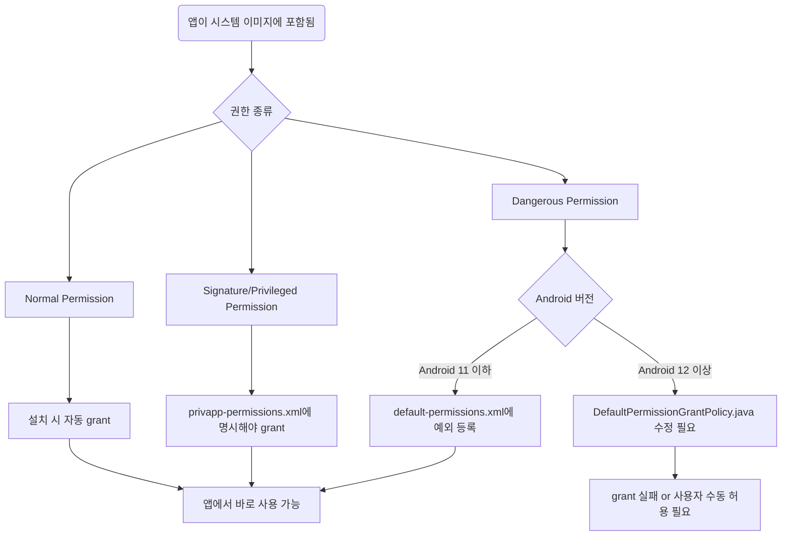

priv-app은 system app의 일부인데 privileged app의 약자다.

system app은 /system/app/에 위치하고 시스템 이미지에 포함되며 시스템 서명이면 일부 시스템 권한만 획득한다. priv-app은 /system/priv-app/에 위치하고 signature+privileged 권한을 갖고 있어서 일반 시스템 앱보다 더 강력한 시스템 API 접근 가능하다. 권한이 priv-app이 더 빡센데, 모든 priv-app이 system app이지만, 모든 system app이 priv-app은 아니다.

안드로이드 시스템에서 `/system/priv-app/` 디렉터리에 설치된 앱을 가리키며 일반적인 앱(data/app/에 설치됨)과 다르게 특별한 시스템 권한(Privileged Permission)을 가질 수 있는 앱이다. 커스텀 펌웨어에서 자동 업데이트, 디바이스 관리, 키오스크 등 특수 목적 앱도 priv-app으로 넣는다.

일반 개발에서는 쓸 수 없고, 루팅된 기기를 다루거나 시스템 쪽 권한을 직접 만질 수 있는 경우라면 접근할 수 있다.

시스템 이미지에 의해 포함된 앱들이고, aosp의 플랫폼 signing으로 빌드되어야 권한을 제대로 부여받는다. aosp로 빌드하는 소스의 manifest에 적당히 선언만 해도 자동 부여되는 게 아니다. 반드시 /system/etc/permissions/privapp-permissions-*.xml 파일에 각 권한을 명시해야 한다.

```xml
<?xml version='1.0' encoding='utf-8' standalone='yes' ?>
<permissions>
    <privapp-permissions
        package="com.abc.example">
        <permission name="android.permission.READ_PRIVILEGED_PHONE_STATE"/>
    </privapp-permissions>
</permissions>
```

그렇지 않으면 시스템이 설치할 때 “권한이 거부됨”으로 처리한다. 근데 문제는 이게 runtime 권한은 제대로 적용되지않는 다는 점이다.

권한 페이지를 가보면, runtime permission들의 level이 dangerous로 되어있는 걸 볼 수 있는데, 이 등급의 보안을 가진 권한들은  privapp-permissions에 선언한다고 부여해주지않는다.

그럼 runtime 권한은 어떻게 부여해야될까?

/system/에 있는 앱에서 사용하는 dangerous level permission은 system/etc/default-permissions_sample-*.xml로 부여 가능하다.

```xml
<exceptions>
    <exception
            package="com.google.android.apps.pixelmigrate">
        <!-- External storage -->
        <permission name="android.permission.READ_EXTERNAL_STORAGE" fixed="false"/>
        <permission name="android.permission.WRITE_EXTERNAL_STORAGE" fixed="false"/>
        <!-- Contacts -->
        <permission name="android.permission.READ_CONTACTS" fixed="false"/>
        <permission name="android.permission.WRITE_CONTACTS" fixed="false"/>
        <!-- Call logs -->
        <permission name="android.permission.READ_CALL_LOG" fixed="false"/>
        <permission name="android.permission.WRITE_CALL_LOG" fixed="false"/>
        <!-- SMS -->
        <permission name="android.permission.RECEIVE_SMS" fixed="false"/>
        <permission name="android.permission.READ_PHONE_NUMBERS" fixed="false"/>
    </exception>
</exceptions>
```

exceptions 태그로 감싸서 runtime권한들을 직접 지정해준다. 권한 보는 건 그냥 `dumpsys package [app package] | grep -i permission`으로 출력하면 된다.

이렇게 xml파일로 default permission을 적어두면 `DefaultPermissionGrantPolicy.java` 코드에서 이 xml을 파싱해서 권한을 부여한다.

문제는 이제 auto grant가 제대로 동작하지 않는 경우가 android 12 이후로 발생한다는 건데, 이 경우 DefaultPermissionGrantPolicy부터 수정해서 aosp를 빌드해야된다. 근데 android 정책이 점점 runtime 권한에 대한 관리를 엄격하게 하고 있어서 이거도 막힐 수 있다.

`frameworks/base/services/core/java/com/android/server/pm/permission/DefaultPermissionGrantPolicy.java`의 `grantDefaultSystemHandlerPermissions`메서드를 적당히 수정해준다.

```java
mService.mSettings.onDefaultRuntimePermissionsGrantedLPr(userId);
// 앞에 바로 위 코드가 존재함
PackageParser.Package yourPackage = getSystemPackageLPr("YOUR_APP_PACKAGE_NAME");
if (yourPackage != null
        && doesPackageSupportRuntimePermissions(yourPackage)) {
    grantRuntimePermissionsLPw(yourPackage, CONTACTS_PERMISSIONS, userId);
    grantRuntimePermissionsLPw(yourPackage, CALENDAR_PERMISSIONS, userId);
}
```

시스템 앱에 대한 권한 프로세스를 mermaid로도 한 번 그려봤다.


