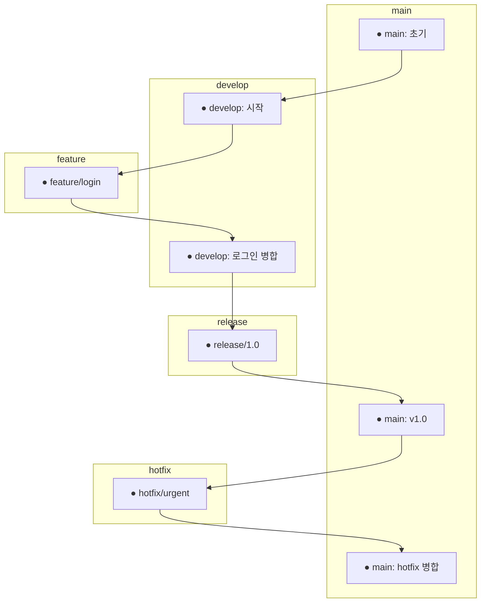
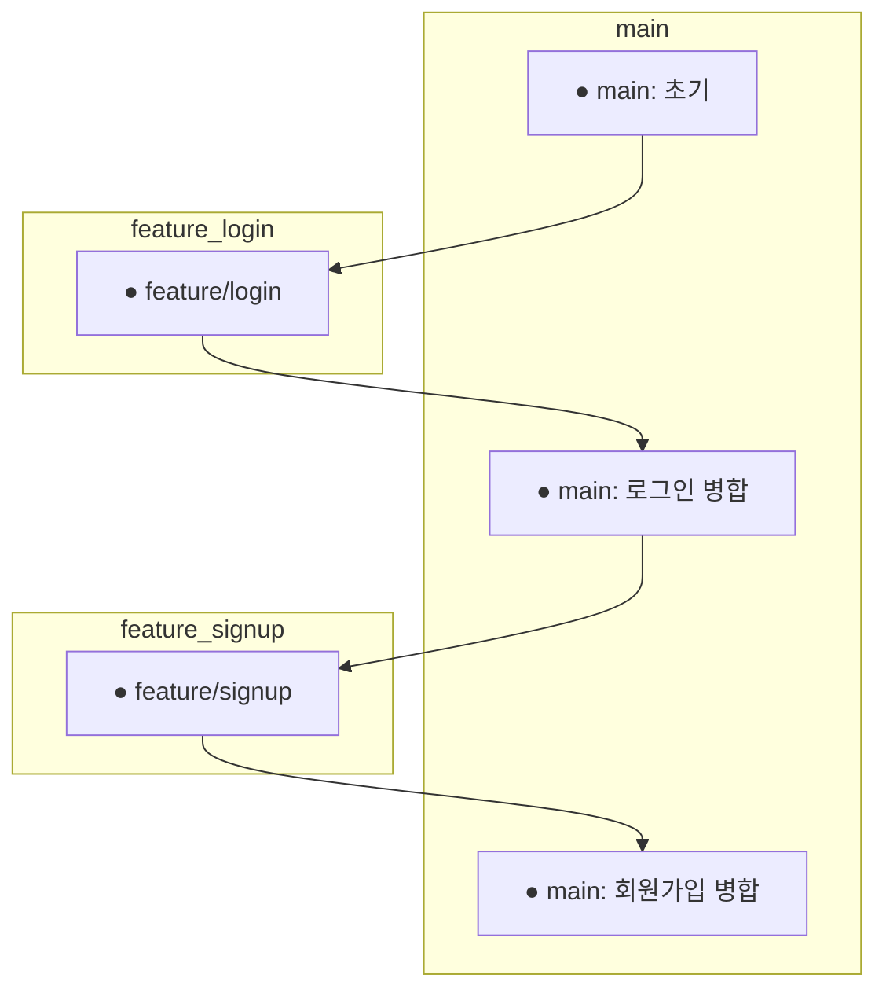
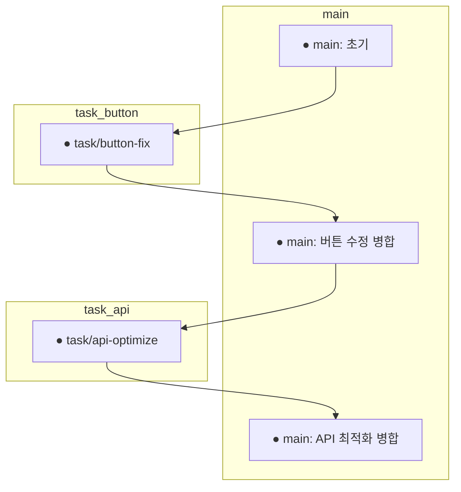

# Git

git을 `add, rebase, commit, push, merge, pull`만 아는 상태라 더 깊은 지식이 필요하다는 생각이 들었다.

## git을 왜 쓸까?

Git은 **버전 관리 시스템**이다. 코드나 문서의 변경 이력을 추적하고(형상관리라고 하는), 여러 개발자들이 동시에 작업해도 충돌을 방지하게 해준다.

`누가 언제 무엇을 바꿨는지` + `특정 기점으로 되돌릴 수 있음` 이 Git을 사용하는 목적이라고 생각한다. 

좀 더 효율을 높이고자 나온 git 브랜치 전략들이 git flow, github flow와 같은 것인데, git flow 정도는 사용해봤다.

## git 브랜치 전략?

브랜치 전략은 git 구조화 룰인데, 이건 팀마다 다를 수 있다고 한다. 이번엔 학습의 의미가 강하니 가장 많이 사용되는 3가지 전략 `git flow, github flow, trunk-based` 를 살펴 보자.

### git flow



git flow는 feture별 branch와, 개발용, 배포용 브랜치로 나누어져있다. main은 항상 배포되게, develop은 개발 통합 브랜치로, 나머지는 `feature/*` `release/*` `hotfix/*` 로 관리한다.

단계별 브랜치가 명확하고, 기능단위로 브랜치가 나뉘어져 있어서 규모가 큰 프로젝트에 사용하기 적합한 전략이다. QA도 따로 가능한 구조이기 때문에 안정성도 높다고 볼 수 있다.


### github flow



github flow는 git flow보다 더 빠르고 유연한 형태다. 항상 배포가 가능한 상태로 있는 main 브랜치를 기준으로, 기능 개발이 필요할 때 main에서 따오고, 완성되면 main으로 병합시킨다. 다만 git flow가 브랜치를 단계별로 나눠놔서 안정성을 확보했던거랑 비교하면 많이 간소화 되어있기 때문에, 배포프로세스에 대한 신중함이 필요하다. main으로 합쳤을 때 배포가 깨질 수 있기 때문이다.

그래서 github flow는 git flow보다 팀 규모가 작고, 빠른 개발이 필요한 환경에서 채택한다고 한다. 

### Trunk-based Development



어떻게 보면 github flow와 비슷한 것 같다. `main`이 유일한 기준 브랜치이며 작은 작업을 따로 짧게 브랜치로 만들고 빠르게 병합하는 걸 목표로한다.

브랜치를 따지 않고 거의 바로 main에 병합하고, 기능이 완성되지 않아도 병합하며 개발 속도, CI 중심 전략이라 github flow보다 안정성은 떨어지지만 `테스트 커버리지가 매우 높을 경우` + `CI가 매우 안정적`으로 되어있을 경우 채택하면 좋은 전략같다.

## 이제 git 명령어를 잘 써보자

```bash
git checkout main
git pull origin main
git checkout -b feature/login
```
브랜치를 생성하는 명령어다. `-b` 옵션을 추가하면, 브랜치 생성과 동시에 전환이 된다. 브랜치를 생성할 때 주의할 점은 항상 최신화된 대상 브랜치에서 checkout해야된다는 점이다.

그래서 main으로 브랜치를 전환해 최신화하고, 브랜치를 생성하는 것이다. 

```bash
git add .
git commit -m "feat: 로그인 페이지 UI 추가"
git push origin feature/login
```
질리도록 사용한 명령어다. 변경이 발생한 파일들을 스테이지에 올리고, commit으로 기록한다. 커밋메시지에 사용될 커밋 컨벤션을 꼭 잘 지키도록 하자.

커밋 뒤에 push를 하면 되는데, 원격저장소에는 로컬에서 생성한 브랜치가 올라가있지 않다. 그래서 `origin feature/login`으로 원격저장소에 브랜치를 올려주는 것이다.

병합과정은 더 단순하다. 근데 방향이 중요하다.

```bash
git checkout main
git pull origin main
git merge feature/login

git push origin main
```
feature/login 브랜치를 main에 합치는 것이다. 나는 합쳐질 브랜치에 위치해야한다. 그래서 main으로 이동해 최신화 해주고, merge로 브랜치를 병합하는 것이다.

충돌나면 잘 알려주니까 그냥 해결하면 된다.

그럼 이제 제일 중요한 *git 실수 했을 때* 대처방법을 알아보자. 물론 커밋을 굉장히 신중히하는 것이 첫번째이겠지만, 그래도 사람은 실수를 하게 되어있다.

실수 시나리오는 많다. 

커밋을 잘못날렸을 경우, 너무 자잘하게 해서 지저분한 경우, 실수로 다른 브랜치에서 딴 경우, 커밋을 그냥 없던일로 하고 싶은 경우... 생각만해도 아찔하지만 침착하게 처리하는 게 더 중요하다.

```bash
git commit --amend

git add LoginUseCase.kt
git commit --amend
```
`--amend`로 방금 날린 commit 메시지를 수정할 수 있다. --amend를 사용하면 `vi 화면` 같은 게 나오고, 거기서 수정하면 된다. vi가 익숙하지 않다면 vscode를 사용하는 방법도 있는 것 같은데 그건 잘 모르겠다.

빠진 파일을 추가하고 커밋메시지를 수정하는 것도 가능하다. 그럼 이미 푸시해버린 경우는 어떻게 해야될까?

```bash
git commit --amend 
git push --force
```
`git push --force`로 덮어 씌워야한다. 문제는 협업일 때 상의 없이 이러면 문제가 생길 수 있으니 force를 사용할 때 꼭 알리도록 하자.

커밋을 신중히 해야하지만, 어쩔 수 없이 중간 저장과 같은 걸 하려면 자잘한 커밋이 늘어날 가능성이 있다. 그럴경우 커밋내역을 단순화 하고 싶거나, 의미없게 넣은 커밋 메시지를 수정하고 싶을 것이다. 이럴 때 `squash`를 써야한다.

시작은 `rebase`다. 이전 커밋을 관리하는 영역이기 때문에 rebase로 커밋을 수정해야한다.

```bash
git rebase -i HEAD~3
```
이 명령어는 최근 3개의 커밋을 내가 원하는 대로 수정하거나 합치기 위해 인터랙티브 리베이스를 시작하자는 의미다. 인터렉티브 리베이스는 amend때와 마찬가지로 vi와 같은 에디터를 띄워준다.

중요한 것은 스테이징 된 커밋메시지를 수정하는 것이기 때문에 커밋이 없다면 오류가 발생할 것이다.


도움말에도 있지만, pick, squash, drop를 알면 된다. 커밋삭제는 drop, 커밋 합치기가 squash다. 지금 커밋을 하나만 해두고, HEAD~1이라 설명과는 상이하지만 맨위 커밋만 pick으로 두고, 나머지를 다 squash나 s로 바꿔주면 된다. 

```bash
pick a123456 feat: 로그인 폼 UI 구현
reword 02be4f8 잘못된 메시지 수정
drop 9c8d1c3 필요 없는 커밋
```

저장하고 닫으면 이제 커밋이 예쁘게 바뀌어있는 걸 볼 수 있다. 이 경우에도 이미 원격에 push됐다면 `--force` 옵션을 켜줘야한다.


