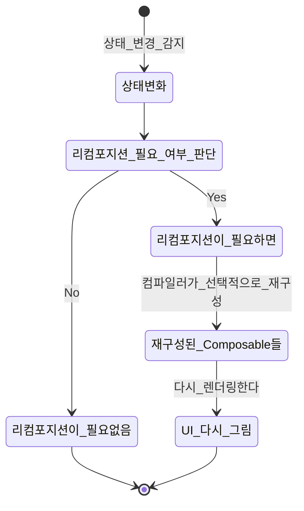

카카오 로그인 구현 중 카카오톡 로그인 Activity를 실행하기 위한 context가 필요했다. 

```kotlin
fun isKakaoTalkLoginAvailable(context: Context): Boolean =
        AuthCodeClient.instance.isKakaoTalkLoginAvailable(context)
```

> Params:
> context - 카카오톡 로그인 Activity를 실행하기 위한 현재 Activity context
> nonce - ID 토큰 재생 공격 방지를 위한 검증 값, 임의의 문자열, ID 토큰 검증 시 사용
> callback - 발급 받은 OAuthToken 반환.

처음에는 viewmodel에서 함수인자로 context를 넣어 호출할 때 context를 받으면 되겠다고 생각했는데, 그게 아니었다.
기존에도 context의 참조는 viewmodel에서 lifecycle차이 때문에 피하는게 좋다고 이해하고 있었는데, 함수 인자로 넘겨서 사용하는 것도 이 문제에 해당했다. 복습도 할 겸 다시 한 번 알아보도록 하자.




## ViewModel과 Context


뷰모델의 수명주기는 액티비티와 분리되어있어서 액티비티의 완전 종료 전 화면회전과 같은 onDestroy가 호출되는 상황에도 데이터의 변화가 없다는게 장점이다. 이 때 context를 사용하게 되면 이 독립된 관계가 깨지게 된다. 

액티비티가 종료됐다고 가정하자. ViewModel은 액티비티의 context를 갖고있는데, 종료된 액티비티의 context를 여전히 가지고 있다. 이때 ViewModel이 종료된 context를 사용해 어떤 작업을 할 경우 context충돌이나 오류가 발생할 위험이 존재한다.


---

> 참조:
> 
> https://developer.android.com/topic/libraries/architecture/viewmodel?hl=ko&authuser=1
> 
> 